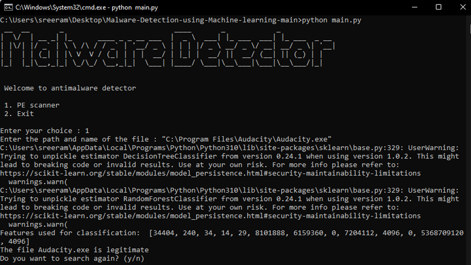
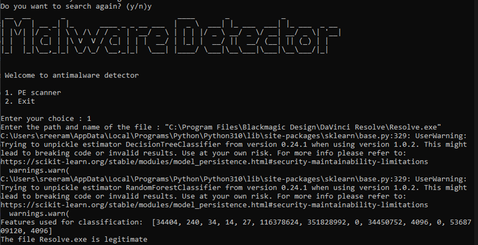
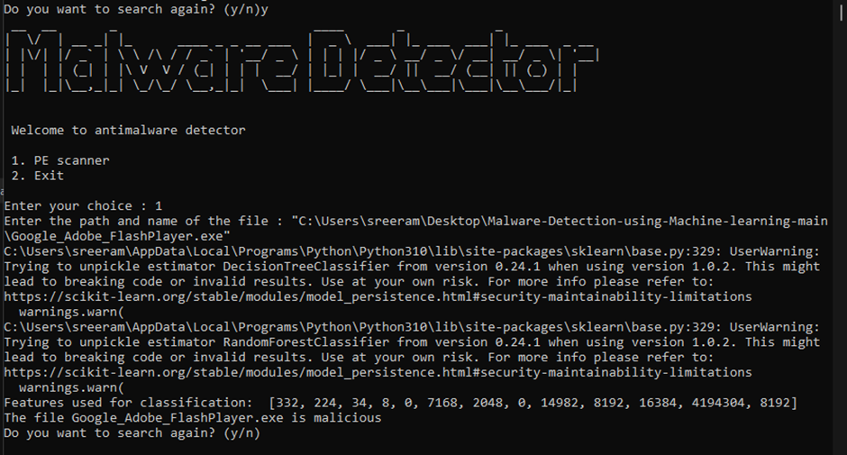
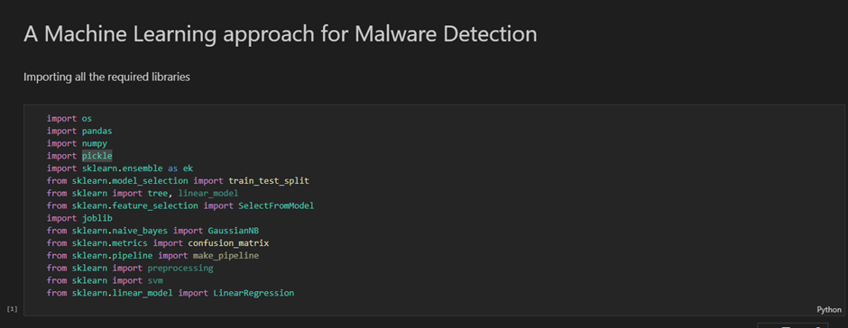
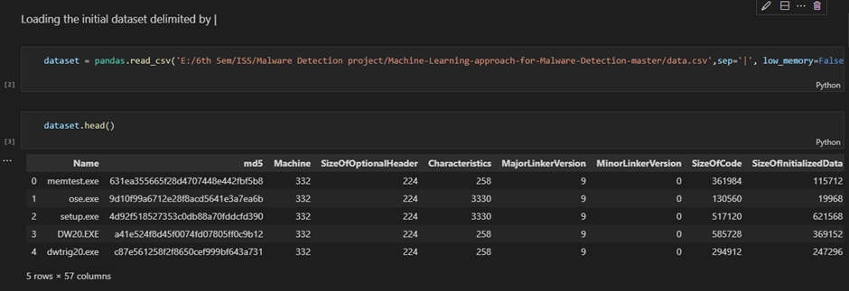
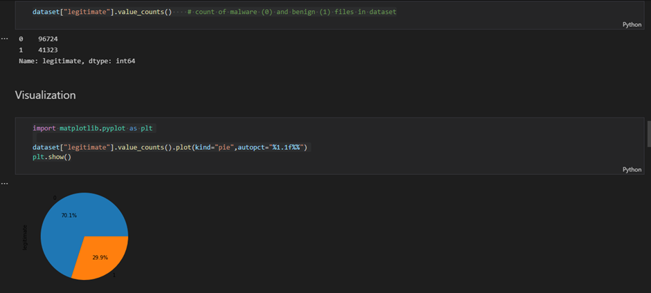

# PYTHON Based Malware detection and classification system

### Abstract
Malware is today one of the biggest security threats to the Internet. Malware is any malicious software with the intent to perform malevolent activities on a targeted system. I present a Machine Learning approach for classifying a file as Malicious or Legitimate, testing and comparing various machine learning methods for Malware detection.

### Problem Statement
With the growth of technology, the number of malware is also increasing day by day. Malware now are designed with mutation characteristics which causes an enormous growth in number of the variations of malware. Not only that, with the help of automated malware-generated tools, novice malware authors are now able to easily generate a new variation of malware. With these growths in new malware, traditional signature-based malware detection is proven to be ineffective against the vast variation.

### In Our Project we have used Heuristic Based Malware Detection
### Modules
 - Data Collection
    We downloaded the dataset from KAGGLE, and we have used that data for malware analysis and classification.
 - Feature Identification
    Feature Selection and Identification is one of the core concepts in machine learning that hugely impacts the performance of your model. The data features that we use to train our machine learning models have a huge influence on the performance you can achieve. Irrelevant or partially relevant features can negatively impact model performance. Feature selection and Data cleaning should be the first and most important step of our model design. In our system, we have used ExtraTreesClassifier for feature identification
 - Building a machine-learning model
    We built a machine learning model in which the approach tries out 6 different classification algorithms before deciding which one to use for prediction by comparing their results. Different Machine Learning models tried are, Linear Regression, Random Forest, Decision Tree, Adaboost, Gaussian, and Gradient Boosting.
 - Training Model 
    In this, we train each machine model that we have used in our system using the X_train and testing with X_test. Finally, the model with the best accuracy will be ranked as the winner
 - File Testing
    To test the model on an unseen file, it's required to extract the characteristics of the given file. Python's pefile.PE library is used to construct and build the feature vector and a ML model is used to predict the class for the given file based on the already trained model. We developed a Python code that extracts all the characteristics of the given file and classifies whether the given input file is malicious or legitimate.

### Proposed Technique
This approach tries out 6 different classification algorithms before deciding which one to use for prediction by comparing their results. Different Machine Learning models tried are, Linear Regression, Random Forest, Decision Tree, Adaboost, Gaussian, and Gradient Boosting. 
To test the model on an unseen file, it's required to extract the characteristics of the given file. Python's pefile.PE library is used to construct and build the feature vector and a ML model is used to predict the class for the given file based on the already trained model.
1. Importing all the required libraries
2. Loading the initial dataset delimited by |
3. Extracting the Number of malicious files vs Legitimate files in the training set
4. Dropping columns like Name of the file, MD5 (message digest), and label
5. Classifying using ExtraTreesClassifier – [ExtraTreesClassifier fits several randomized decision trees (a.k.a. extra-trees) on various sub-samples of the dataset and uses averaging to improve the predictive accuracy and control over-fitting]
6. Display the Number of Features
7. Cross Validation (Cross-validation is applied to divide the dataset into random train and test subsets. test_size = 0.2 represents the proportion of the dataset to include in the test split)
8. Display Features identified by ExtraTreesClassifier
9. Building a Machine Learning Model
10. Training each of the models with the X_train and testing with X_test. The model with the best accuracy will be ranked as the winner
11. Saving the Model
12. Calculating False positives and False negatives on the data set
13. Testing Files with the best accuracy model and checking whether it is malicious or legitimate

**Here We have used two different systems. One for analyzing only the dataset and another for analyzing the dataset as well as classifying whether the given input file is malicious or legitimate**

### RESULTS(sample images)

**Testing a file whether it is malicious or legitimate**

**MODEL 1**

**MODEL 2**

